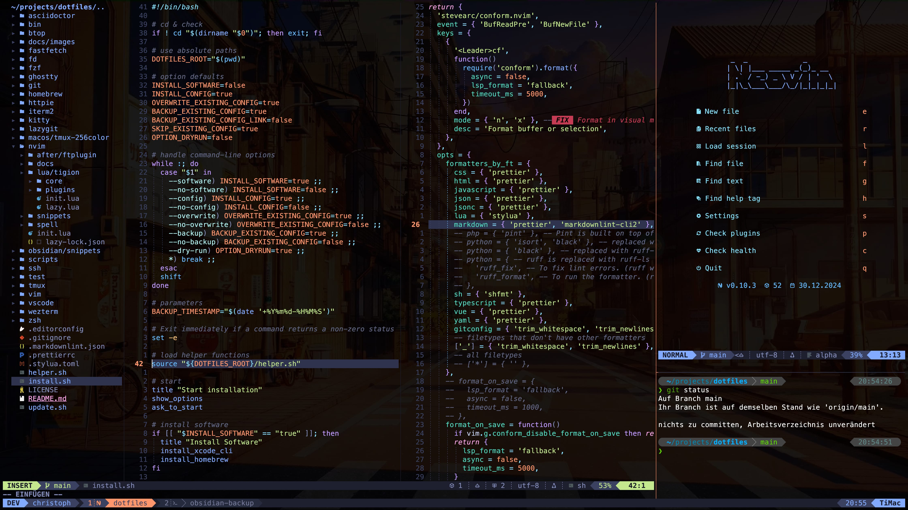
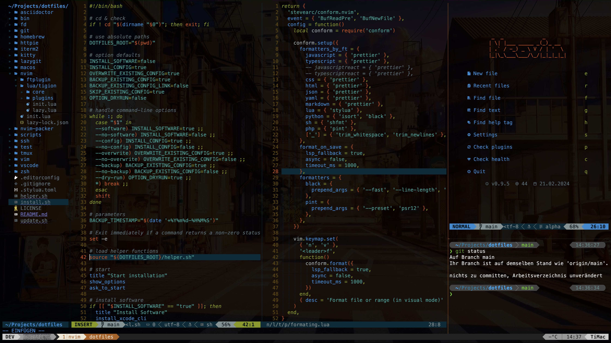
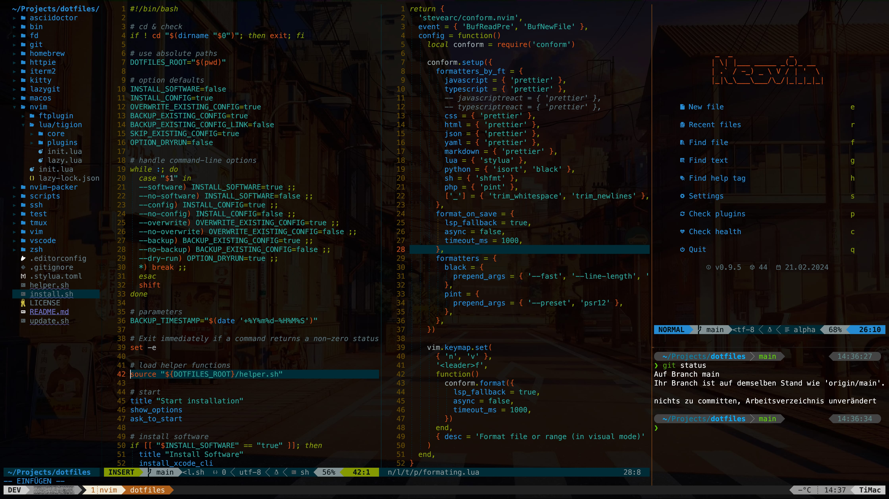
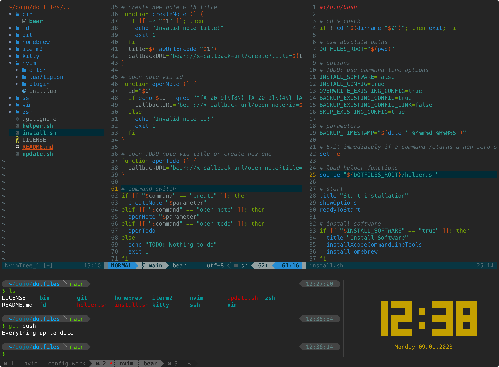

# dotfiles

These are my **dotfiles** for **macOS** and partly **Ubuntu**.
Inspired by the many great dotfile repositories out there.

> [!WARNING]
> Work in progress. Use at your own risk.
>
> The _install.sh_ and _update.sh_ are currently only for macOS.

- Screenshot: [kitty](https://sw.kovidgoyal.net/kitty/)
  with [tmux](https://github.com/tmux/tmux/wiki)
  and [Neovim](https://neovim.io/) on macOS

## Good to know

I use a German keyboard layout (qwertz), so I have adjusted some key mappings.

- for example `,` -> `ö`

- [My Neovim keymaps](nvim/docs/keymaps.md)

## Usage

> [!NOTE]
> More instructions and information about the repository will follow soon.
>
> Questions are also welcome via GitHub Issues.

## Old Screenshots

- 21.02.2024, [kitty](https://sw.kovidgoyal.net/kitty/)
  with [tmux](https://github.com/tmux/tmux/wiki)
  and [Neovim](https://neovim.io/) on macOS:

    <!--  -->
    

- 09.01.2023, [kitty](https://sw.kovidgoyal.net/kitty/)
  with [Neovim](https://neovim.io/) on macOS:

    <!--  -->
    
